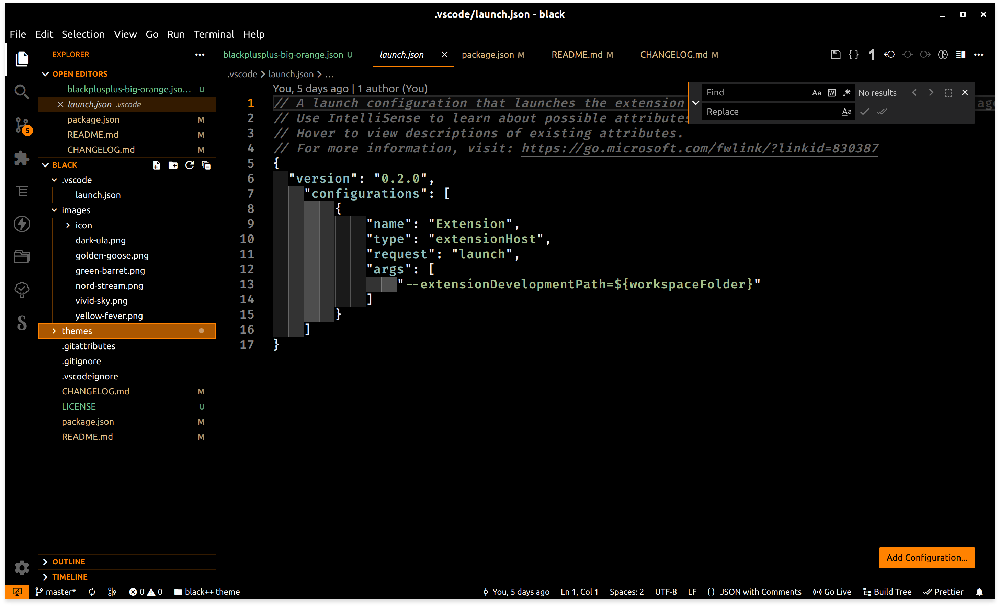
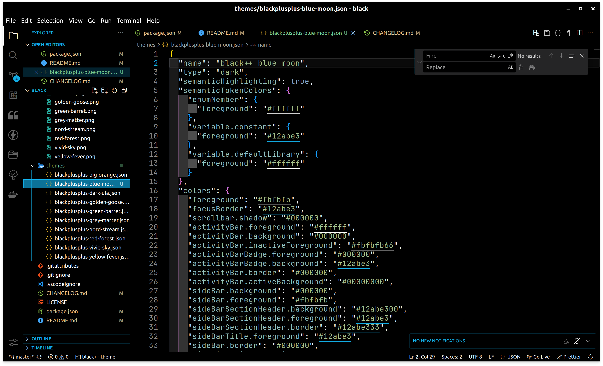
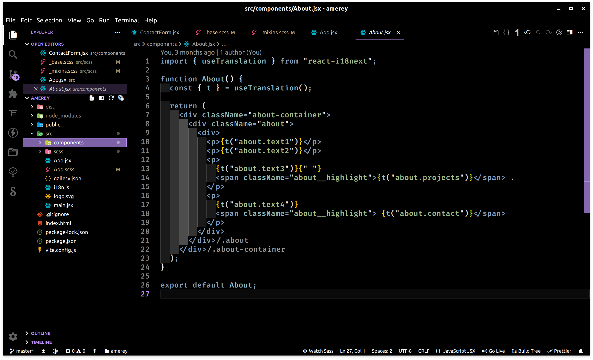
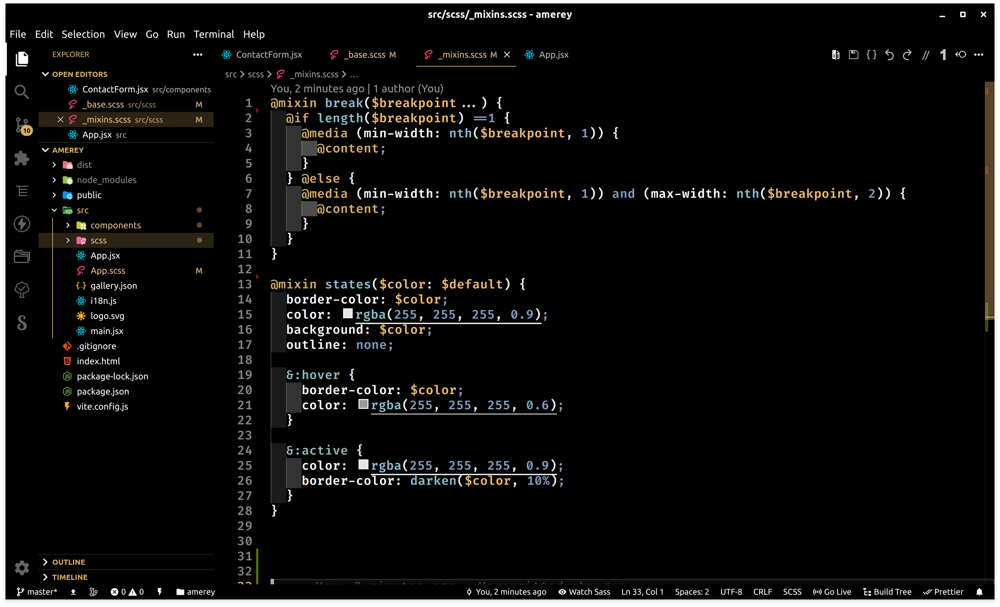
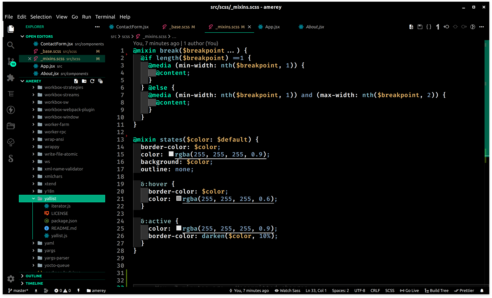
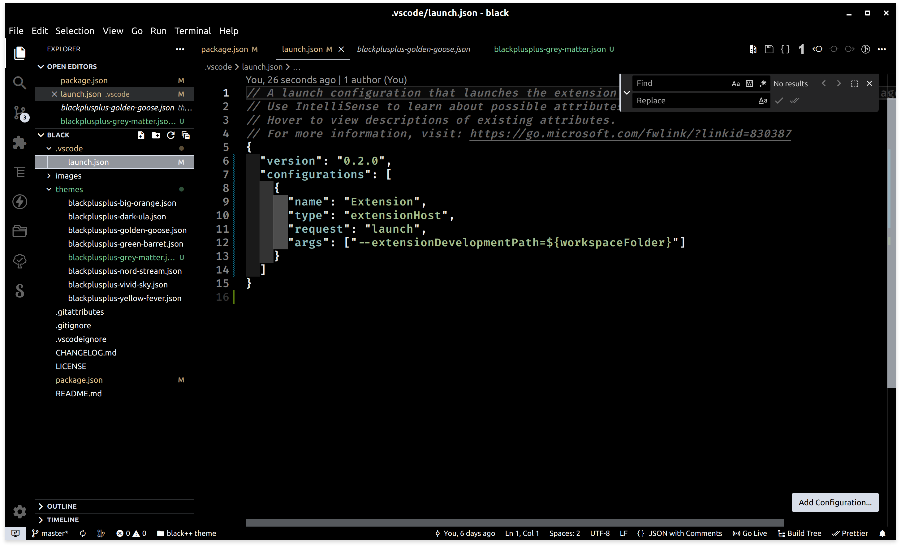
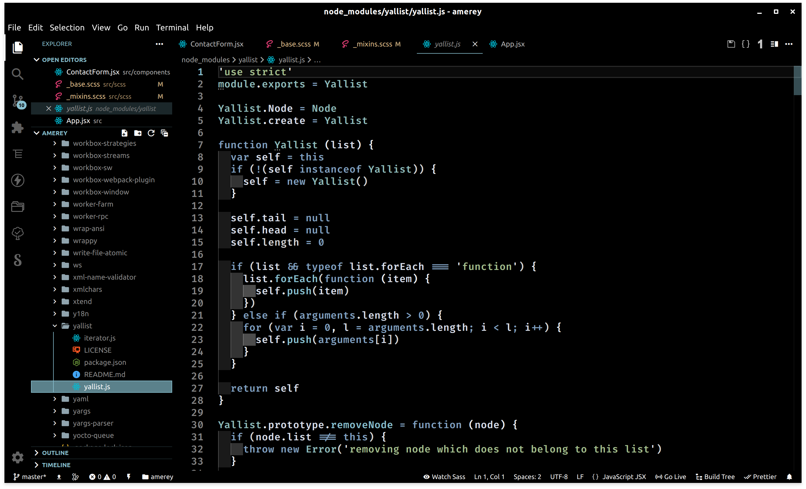
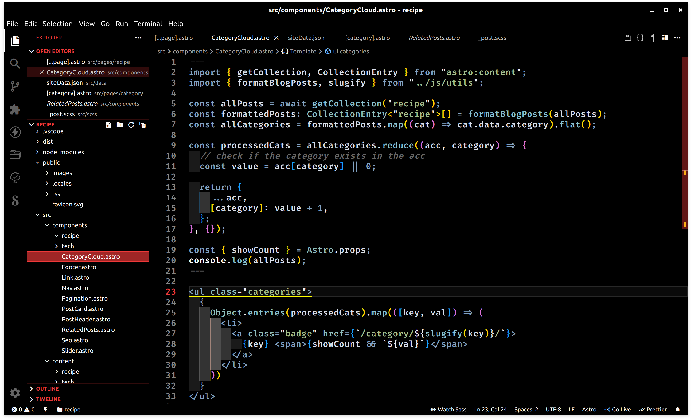
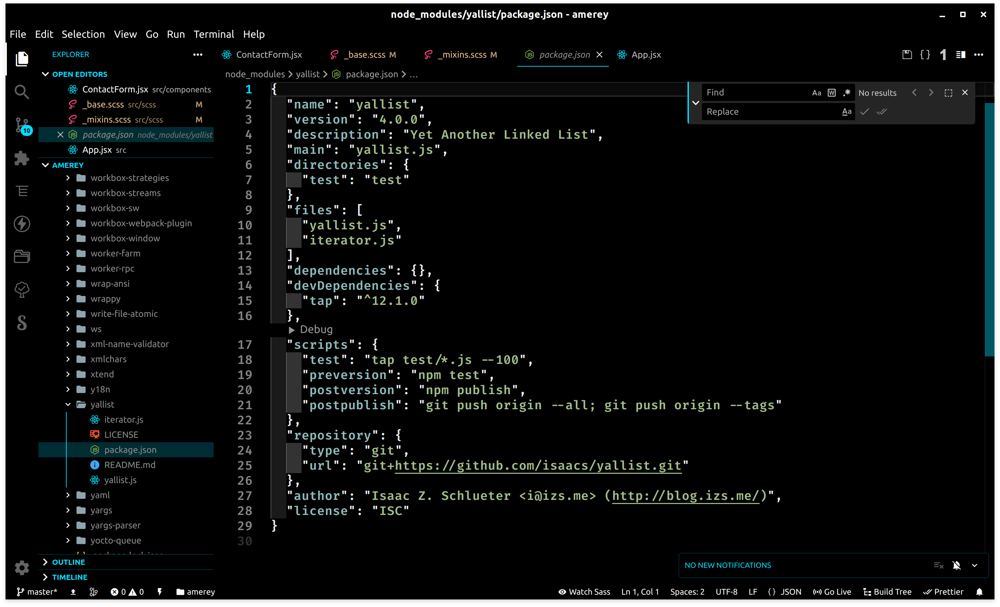
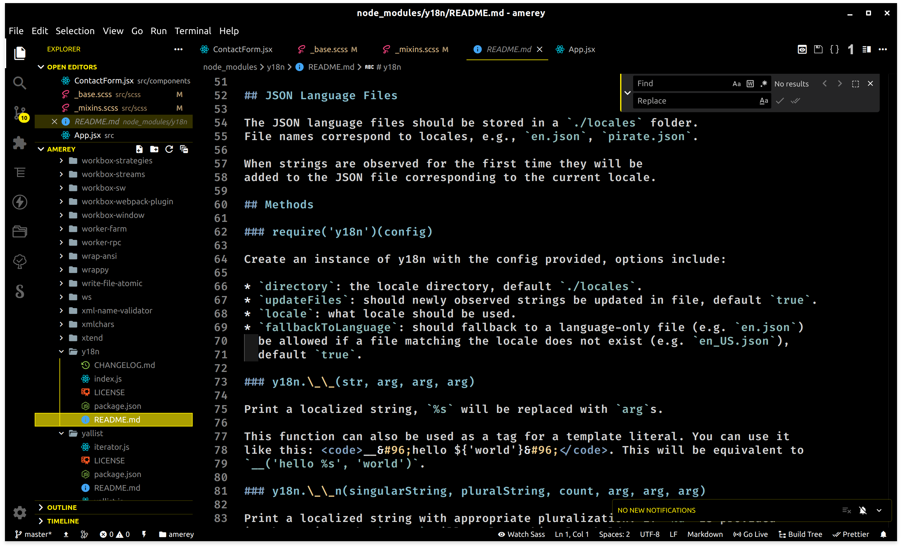

<p align="center">
  
</p>

<h1 align="center">Black++ theme</h1>

<p align="center">
  <a href="https://github.com/Amereyeu/Black-plus-plus-vscodium">
    
  </a>
  <a href="https://open-vsx.org/extension/Amerey/blackplusplus">
    
  </a>
  <a href="https://open-vsx.org/extension/Amerey/blackplusplus">
    
  </a>
  <a href="https://github.com/Amereyeu/Black-plus-plus-vscodium/issues">
    
  </a>
  <a href="https://ko-fi.com/amerey">
    
  </a>
</p>

### Big Orange Theme



### Blue Moon Theme



### Dark Ula Theme



### Golden Goose Theme



### Green Barret Theme



### Grey Matter Theme



### Nord Stream Theme



### Red Forest Theme



### Vivid Sky Theme



### Yellow Fever Theme



Theme is combined with [Indent Rainbow](https://open-vsx.org/extension/oderwat/indent-rainbow) extension - for colors use following setting:

```
"indentRainbow.colors": [
  "rgba(255,255,255,0.1)",
  "rgba(255,255,255,0.2)",
  "rgba(255,255,255,0.3)",
  "rgba(255,255,255,0.2)",
  "rgba(255,255,255,0.1)"
]
```
